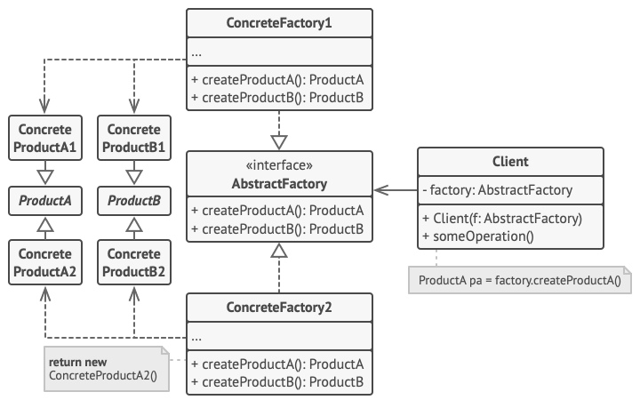

# Abstract factory
## Problems can be solved
* There is a set of items are related to each other. For example furniture (sofa, chair, table, etc). 
* There are several variations of this set.
## UML

## Extra resources
* https://habr.com/ru/post/465835/
* https://refactoring.guru/design-patterns/abstract-factory
* https://www.youtube.com/watch?v=cmyUI_ZezoU&t=541s&ab_channel=EugeneSuleimanov