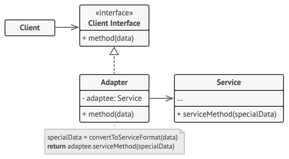

# Adapter
## Problems can be solved
* If need to provide interaction of objects with different interfaces. Adapt rather than rewrite existing code to the required interface.
## UML

## Additional information
#### Class adapter and Object adapter
Class Adapter uses inheritance and can only wrap a class.
```java
class Adapter extends IncompatibleClass implements ExistingInterface {
    @Override 
    void doSomethingByExistingInterface() {
        doSomething();
    }
}
```
Object Adapter uses composition and can wrap classes or interfaces, or both. It can do this since it contains, 
as a private, encapsulated member, the class or interface object instance it wraps.
```java
class Adapter implements ExistingInterface {
    private IncompatibleClass adapte;
    
    public Adapter(IncompatibleClass apdate) { 
        this.adapte = apdate;
    }

    @Override
    void doSomethingByExistingInterface() {
        adapte.doSomething();
    }
}
```
## Extra resources
* https://refactoring.guru/design-patterns/adapter
* https://www.youtube.com/watch?v=VunUuXyJw2U&ab_channel=EugeneSuleimanov
* https://javarush.ru/groups/posts/2139-pattern-proektirovanija-adapter
* [Difference between object adapter and class adapter](https://stackoverflow.com/questions/9978477/difference-between-object-adapter-pattern-and-class-adapter-pattern)