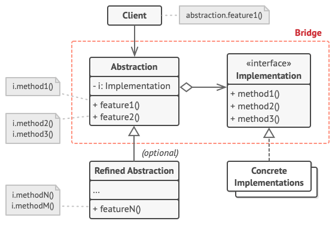

# Bridge
## Problems can be solved
* if you need to separate the abstraction from the implementation (classes that delegate and real classes. Check example)
## UML

## Extra resources
* https://refactoring.guru/design-patterns/bridge
* https://javarush.ru/groups/posts/2570-znakomstvo-s-patternom-proektirovanija-bridge