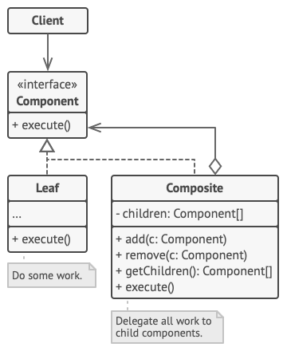

# Compositor
## Problems can be solved
* It defines class hierarchies that contain primitive and complex objects by one interface
## UML

## Extra resources
* https://refactoring.guru/design-patterns/composite
* https://www.youtube.com/watch?v=Cg6tWd74f4E&t=1227s&ab_channel=DmitryAfanasyev