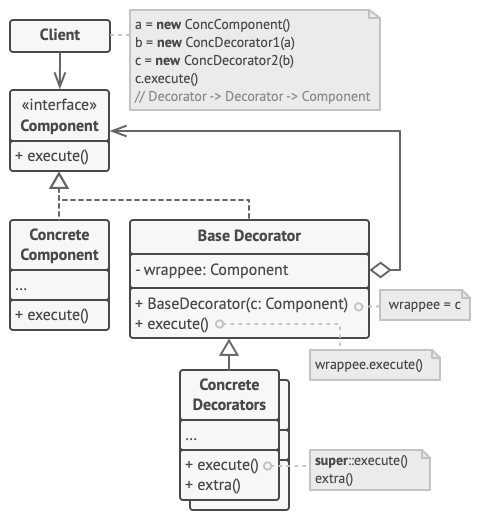

# Decorator
## Problems can be solved
* It lets you attach new behaviors to objects by placing these objects inside special 
  wrapper objects that contain the behaviors.
## UML

## Extra resources
* https://refactoring.guru/design-patterns/decorator
* https://www.youtube.com/watch?v=2aB2B3b3bQA&ab_channel=EugeneSuleimanov