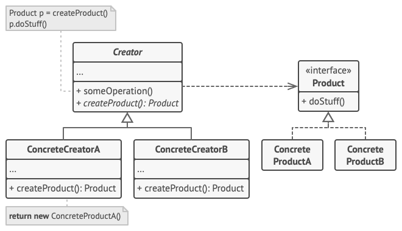

# Factory method
## Problems can be solved
* When a class doesn't know what sub-classes will be required to create
* When a class wants that its sub-classes specify the objects to be created.
## UML
## Additional information
#### Abstract Factory vs Factory Method ####
1. Abstract factory used for a set of items, Factory method used for only one item.
2. Abstract factory is an object that creates set of items and can be extended, 
   Factory method is a method that creates one object and can be overridden.
   
```java
    /* 
    *  This is the abstract factory. It can create several objects.
    *  This example uses GUI elements and some certain factory can 
    *  implement this interface (For example AwesomeThemeFactory)
    */
    interface AbstractFactory {
        Button createButton();
        TextField createTextField();
        Form createForm();
    }
```

```java
    /* 
    *  This is the basic factory class. It can be extended by a certain 
    *  class (for example with LoginForm with "LoginButton")   
    */
    abstract class Form {
        /* some logic */
   
        /*
         *  This is factory method that is overridden and creates objects 
         *  in subclasses.
         */
        abstract Button createButton();
    }
```
## UML

## Extra resources
* https://refactoring.guru/design-patterns/factory-method
* [Difference between Abstract factory and Factory Method](https://stackoverflow.com/questions/5739611/what-are-the-differences-between-abstract-factory-and-factory-design-patterns)