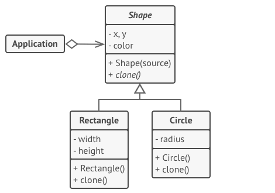

# Prototype
## Problems can be solved
* When you need to clone objects
## UML 

## Extra resources
* https://refactoring.guru/design-patterns/prototype
* https://www.youtube.com/watch?v=7X3eQZX5b9Y&t=2s&ab_channel=EugeneSuleimanov